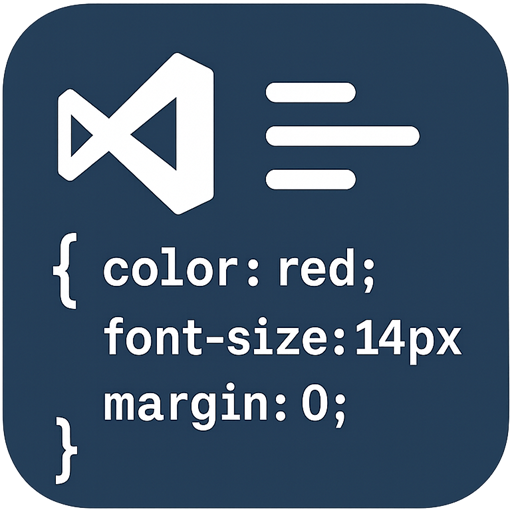

# vscode-stylesheet-sort

  

A Visual Studio Code extension to sort CSS, SCSS, and Less property declarations within rules. Utilizes the [`css-declaration-sorter`](https://github.com/Siilwyn/css-declaration-sorter) library via PostCSS to reorder declarations based on predefined or alphabetical order.

## Features

- Sorts CSS, SCSS, and Less property declarations
- Supports multiple sorting orders: `alphabetical`, `smacss`, `concentric-css` as [`css-declaration-sorter`](https://github.com/Siilwyn/css-declaration-sorter)
- Option to preserve the order of shorthand properties overriding longhand properties
- Integrates directly into the VS Code Command Palette

## Usage

1. Open a CSS, SCSS, or Less file
2. Open the Command Palette (`Ctrl+Shift+P` or `Cmd+Shift+P`)
3. Search for and select the command `StyleSheet Sort: Sort CSS / Less / SCSS Declarations`
4. The declarations in the current file will be sorted according to the configured order if possible

## Configuration

You can configure the extension's behavior via VS Code settings (`File > Preferences > Settings`):

- `stylesheetSort.order`

> Description: The order to sort CSS declarations by.
>
> Type: `string`
>
> Options: `"alphabetical"`, `"smacss"`, `"concentric-css"`
>
> Default: `"smacss"` (Different from [`css-declaration-sorter`](https://github.com/Siilwyn/css-declaration-sorter))

- `stylesheetSort.keepOverrides`

> Description: Keep shorthand declarations overriding longhand declarations in their original order (e.g., `animation-name: some; animation: greeting;`).
>
> Type: `boolean`
>
> Default: `false`
